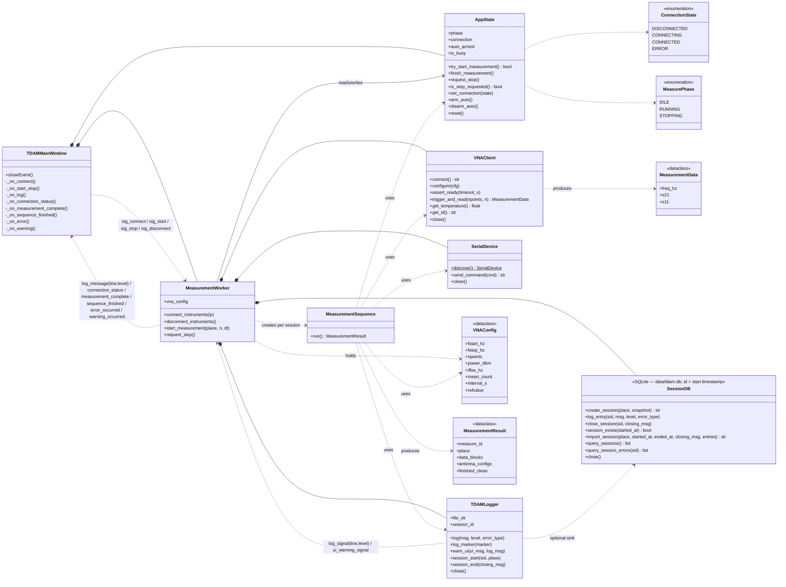

# Class Diagram

Static structure of the TDAM core. Shows the seven runtime classes, the two
state enums, and the dataclasses that flow between them.

## How to read this

- **Filled diamond `◆--`** — composition: the owner constructs and disposes the
  child. `MeasurementWorker` instantiates `SerialDevice`, `VNAClient`,
  `SessionDB`, and `TDAMLogger` inside `connect_instruments()` and tears them
  down in `_close_all()`.
- **Solid arrow `->`** — runtime read/write association without ownership.
  `MeasurementWorker` mutates `AppState` it does not own (the window owns it).
- **Dashed arrow `-->`** — dependency / "uses" / "produces". `MeasurementSequence`
  holds borrowed references for the lifetime of one `run()` call.
- **Dashed arrows labelled with signal names** — Qt signal/slot wiring (the
  three-hop log chain is documented at `src/tdam/core/logger.py` + `core/worker.py`).

