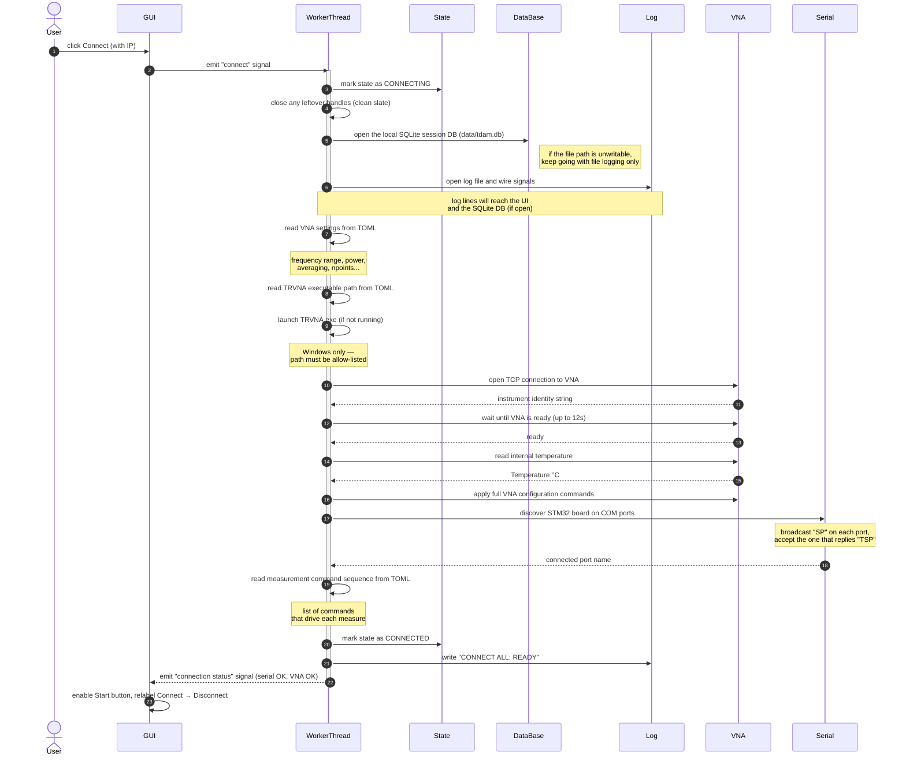

# Sequence Diagram — Connect (action view)

Plain-language view of the connect flow. Shows **what each step does** rather
than which function is called. Pair this with `sequence-connect_classes.md`
when handing the project over: read this first to understand the *story*, then
the class diagram to see the *code*.

## What can go wrong

If any step above fails, the worker:

1. Marks the connection state as **ERROR**.
2. Picks a short user-facing message based on what failed:
   - serial discovery → "Serial port not found."
   - TRVNA launch → "Could not launch TRVNA."
   - anything else (VNA connect, config load, ...) → "Could not connect to the VNA."
3. Closes every handle it managed to open (rollback).
4. Sends that short message to the UI as an error popup.
5. Sends a connection-status update reflecting whatever was opened before the
   failure — so the LEDs show partial success (e.g. VNA green, serial red).

## When to read this vs the class view

- **This file (actions):** first read for a new contributor or non-developer
  stakeholder. Tells the story of "what happens when the user clicks Connect"
  without naming any Python function.
- **`sequence-connect_classes.md`:** for the engineer who needs to find the
  code. Same flow, but every arrow names the actual class, method, or module
  function being called.
