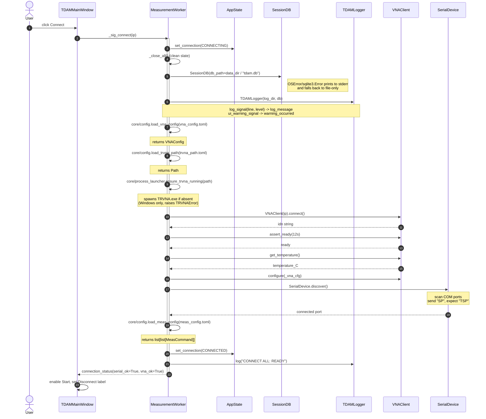

# Sequence Diagram — User clicks Connect

Startup orchestration. Triggered when the user clicks **Connect** with an IP
address; ends with the `connection_status` signal flipping the UI into the
"connected" state and unlocking the Start button.

## Failure paths (not drawn)

If any step inside the try-block raises, the worker:

1. Sets `AppState.connection` to `ERROR`.
2. Picks a short user-facing message based on the exception class
   (`SerialError` -> "Serial port not found.", `TRVNAError` -> "Could not
   launch TRVNA.", anything else -> "Could not connect to the VNA.").
3. Calls `_rollback()` (which is `_close_all()`).
4. Emits `error_occurred(short_msg + " See log for details.")`.
5. Emits `connection_status(serial_ok, vna_ok)` with whatever flags were set
   before the failure — partial success surfaces in the indicator LEDs.

See `core/worker.py:160-180` for the exception-to-label mapping.
