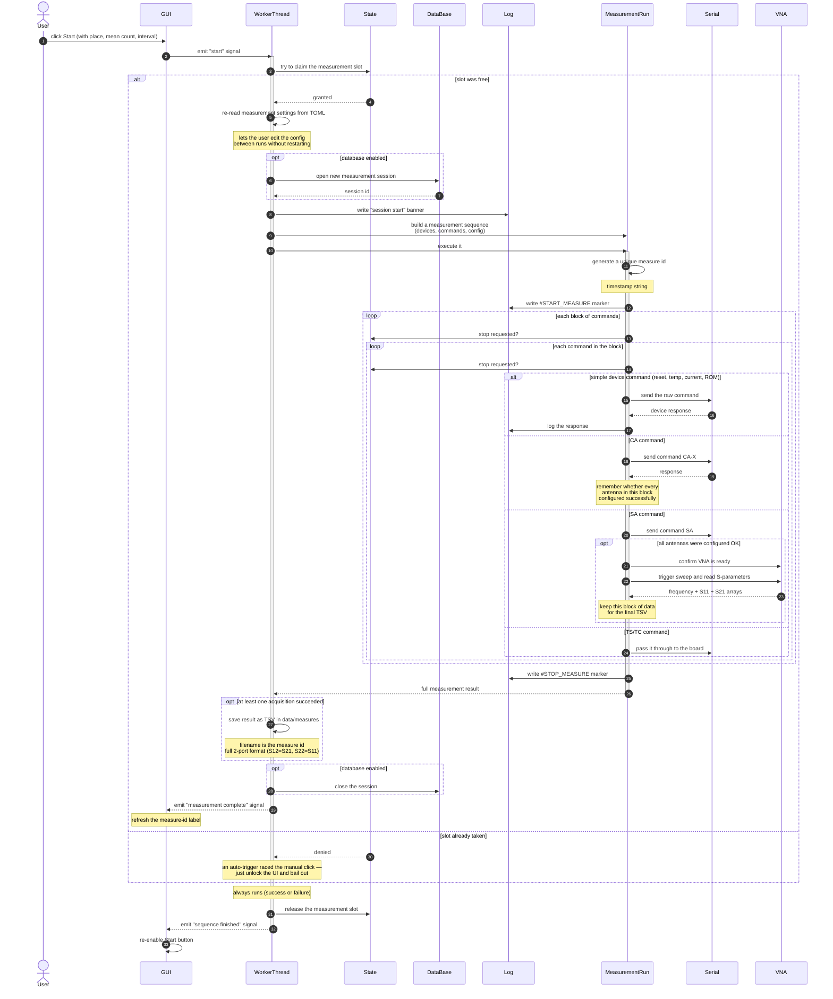

# Sequence Diagram — Measurement (action view)

Plain-language view of the measurement flow. Shows **what each step does**
rather than which function is called. Pair this with
`sequence-measurement_classes.md` when handing the project over: read this
first to understand the *story*, then the class diagram to see the *code*.

## Stop semantics

The worker checks for a stop request **twice per command** — once before
starting a new block and once before each command in the block. A stop
request lets the current command finish (no mid-command abort) and then exits
both loops cleanly. The result reports whether the run completed normally
or was interrupted.

## What can go wrong

If anything inside the measurement raises an unexpected error, the worker:

1. Marks the closing banner as `#ERROR` instead of `#STOP_MEASURE`.
2. Writes the error to the log with type `VNA_SCPI_ERROR`.
3. Sends "Measurement aborted. See log for details." to the UI as a popup.
4. Still runs the cleanup steps — closes the database session, releases the
   slot, emits "sequence finished" — so the UI never gets stuck on Stop.

## When to read this vs the class view

- **This file (actions):** first read for a new contributor or non-developer
  stakeholder. Tells the story of "what happens when the user clicks Start"
  without naming any Python function.
- **`sequence-measurement_classes.md`:** for the engineer who needs to find
  the code. Same flow, but every arrow names the actual class, method, or
  module function being called.
