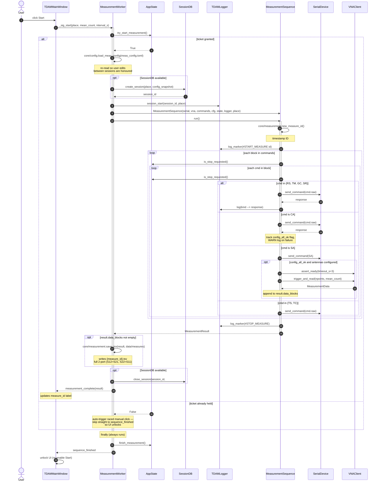

# Sequence Diagram — User clicks Start

Hot path. Triggered when the user clicks **Start** with a place name and
mean/interval values; ends with the `sequence_finished` signal returning the
UI to the idle state.

## Stop semantics

`is_stop_requested()` is checked at two cancellation points per command —
once before each block and once before each command within a block. A stop
request lets the current command finish (no mid-SCPI abort) and then exits
both loops. The `MeasurementResult.finished_clean` flag in the return value
encodes whether the run completed normally or was interrupted.

## Error path

If anything inside `start_measurement` raises:

1. `closing_msg` becomes `#ERROR`.
2. Logger writes `Measurement error: ...` with `error_type=VNA_SCPI_ERROR`.
3. UI receives `error_occurred("Measurement aborted. See log for details.")`.
4. The `finally` block still runs — DB session closes, ticket releases,
   `sequence_finished` emits — so the UI always returns to the idle state.
