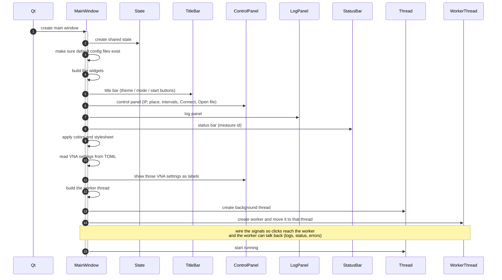
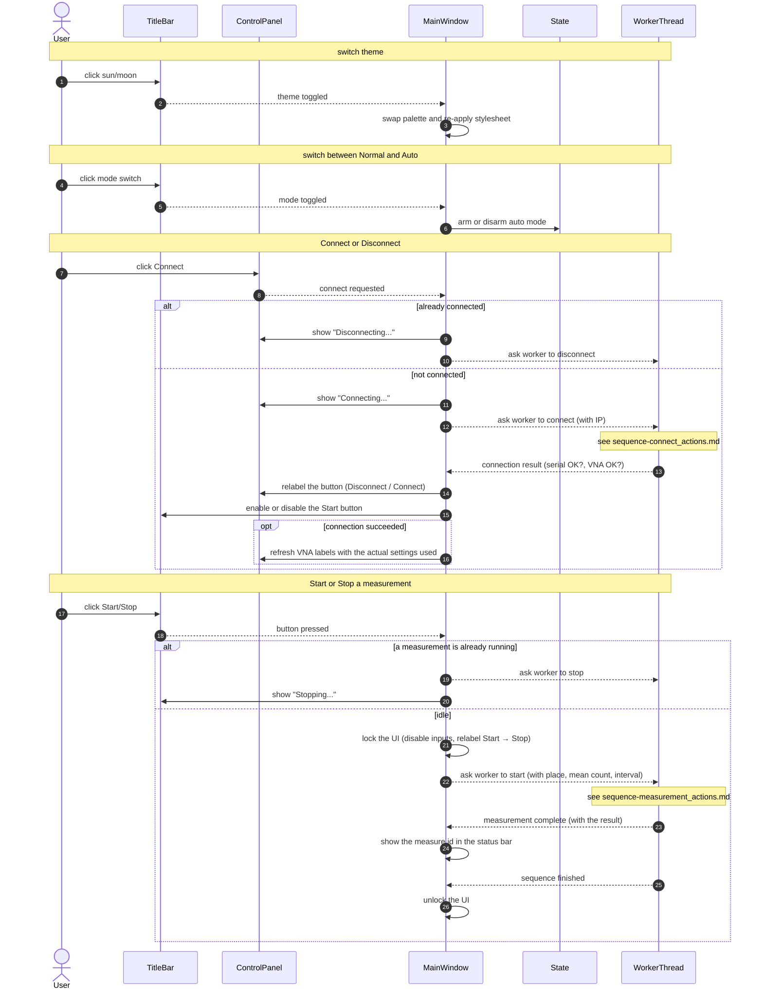
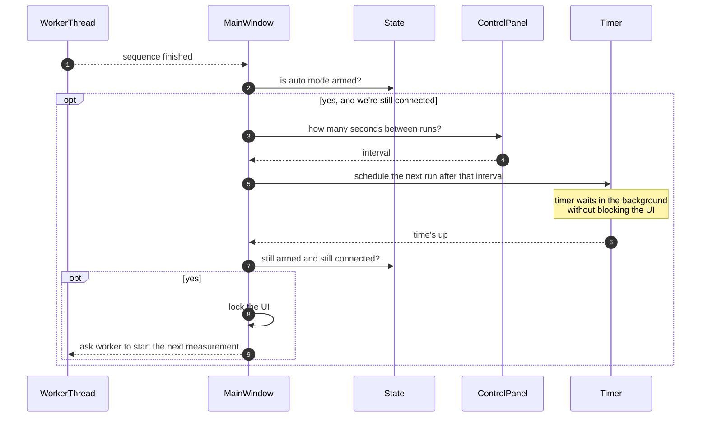
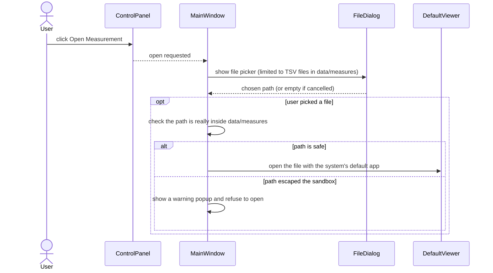
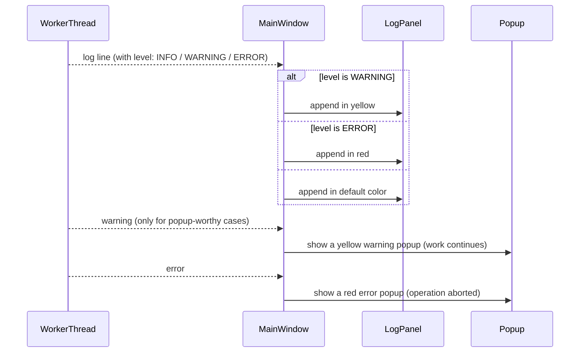
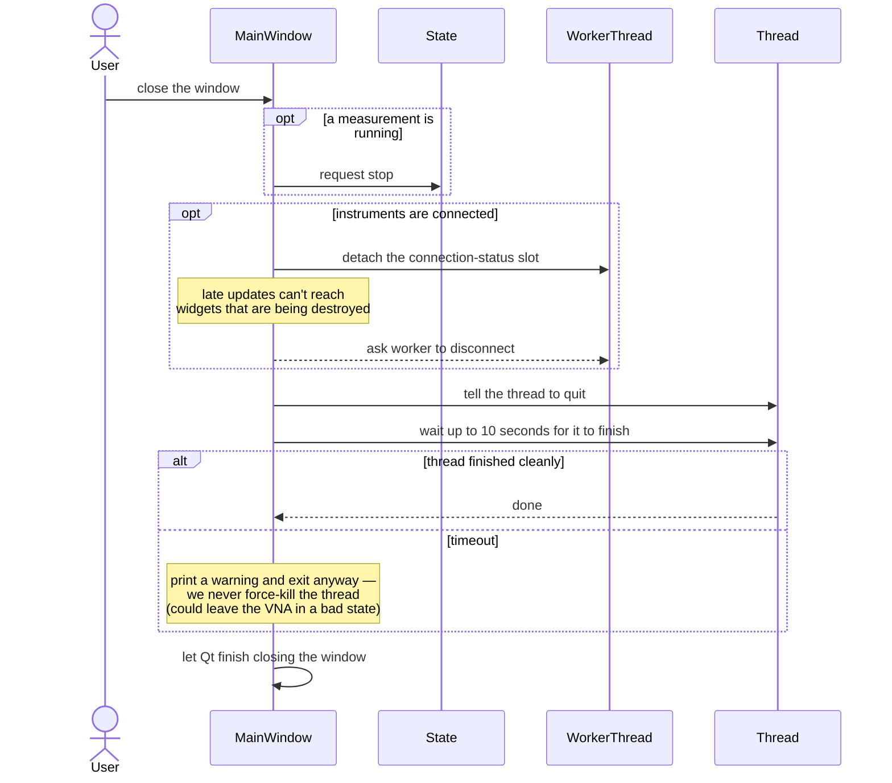

# Sequence Diagram — TDAMMainWindow lifecycle (action view)

Plain-language view of the application window: how it starts up, how it
reacts to clicks, the auto-mode loop, and how it shuts down. Pair with
`sequence-window_classes.md` for the code-oriented version.

The connect and measurement flows themselves are collapsed here — see the
`sequence-connect_actions.md` and `sequence-measurement_actions.md` files
for the story of what happens *inside* those operations.

## Startup & wiring

## What clicks do

## Auto-mode loop

Auto mode runs until: the user disarms it, the user disconnects (the worker
clears the auto flag on disconnect), or any error puts the connection in the
ERROR state.

## Open a measurement file

## Log, warning, error popups

Most warnings are log-only (yellow line in the log panel). The popup
warning channel is reserved for cases the user must acknowledge —
intentionally **not** used for advisory issues during connect (e.g. log
file unavailable, VNA temperature unreadable), which would otherwise
stack on top of any later error popup.

## Closing the window

## When to read this vs the class view

- **This file (actions):** first read for a new contributor or non-developer
  stakeholder. Tells the story of "what the application window does, from
  startup to shutdown" without naming Qt classes or Python methods.
- **`sequence-window_classes.md`:** for the engineer who needs to find the
  code. Same flow, but every arrow names the actual widget, signal, slot,
  or method involved.
