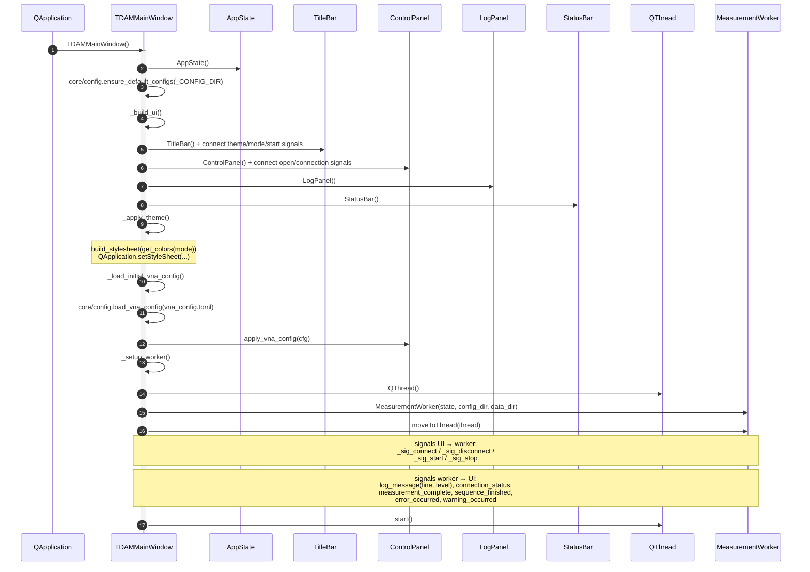
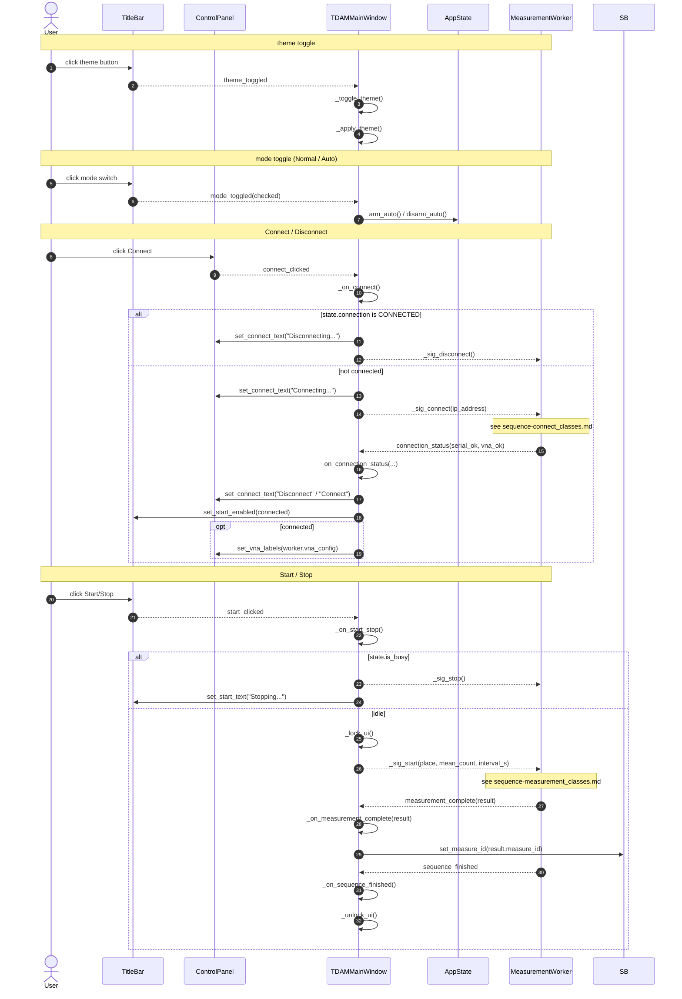
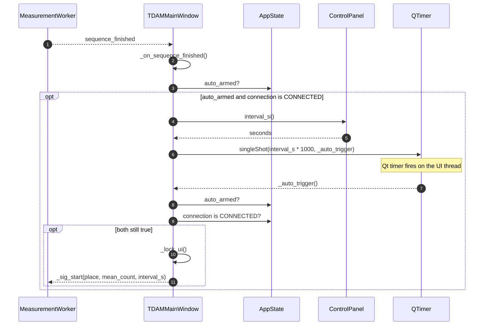
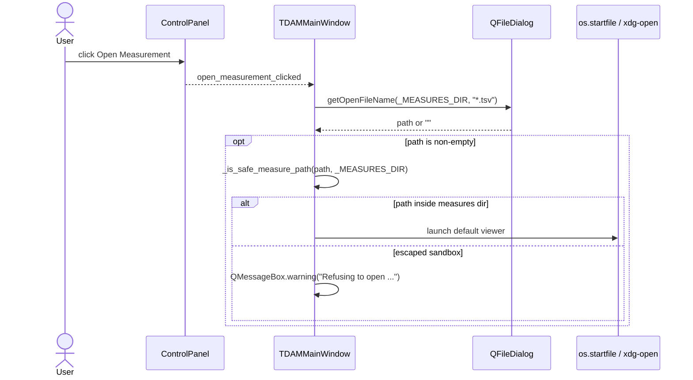
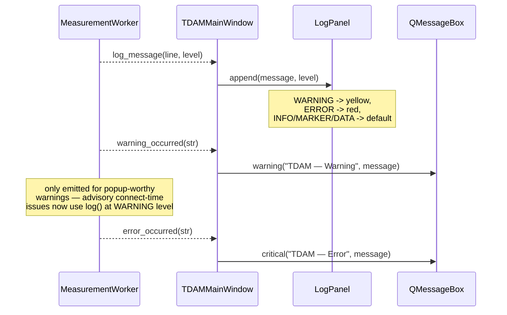
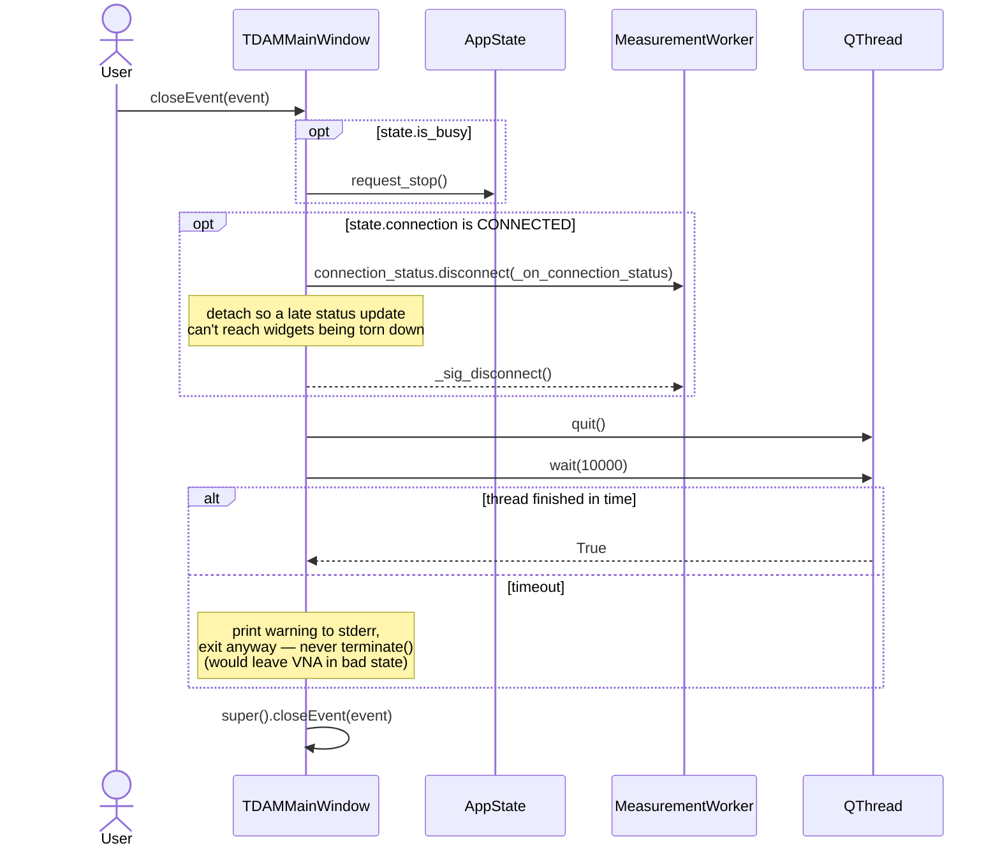

# Sequence Diagram — TDAMMainWindow lifecycle (class view)

UI-thread view of the application: window construction, signal wiring, the
event handlers that translate clicks into worker signals, and shutdown. Pair
with `sequence-window_actions.md` for the plain-language version.

The hot paths inside the worker (connect, measurement) are intentionally
collapsed here — see `sequence-connect_classes.md` and
`sequence-measurement_classes.md` for those.

## Construction & wiring

## User input handlers

## Auto-mode loop

## Open measurement file

## Log / error / warning relays

## Close

