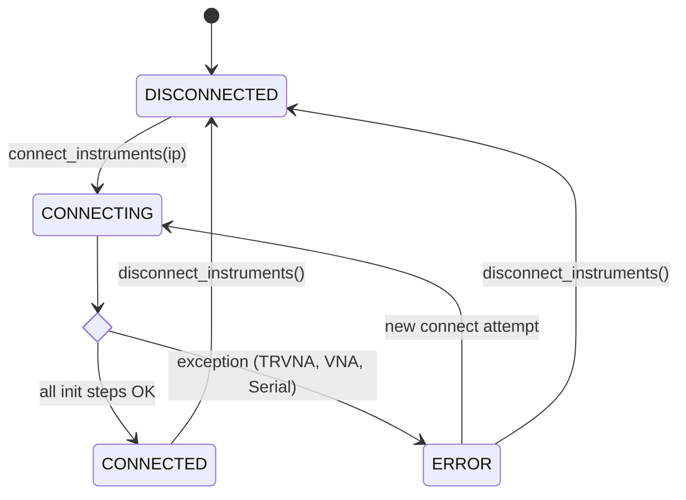
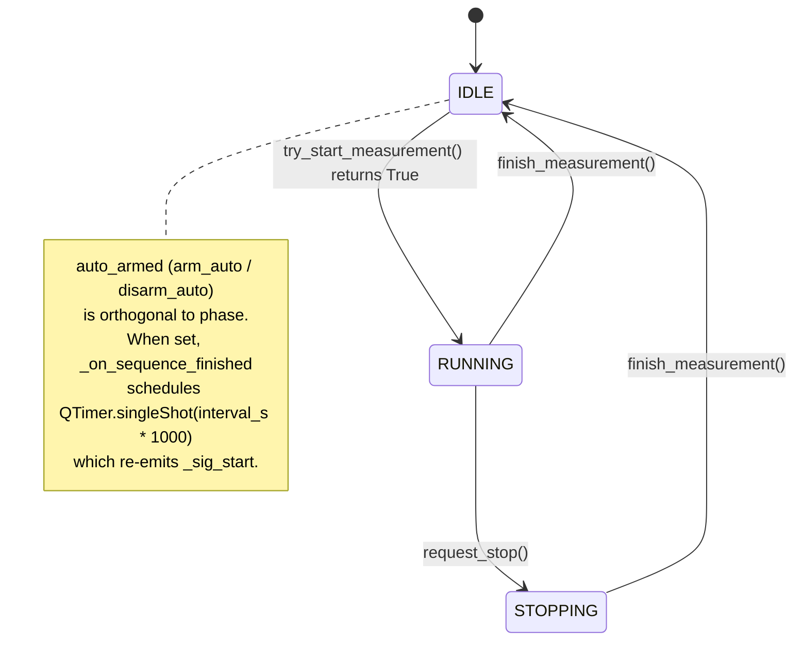

# State Diagrams

`AppState` runs two **independent** state machines plus an orthogonal
`auto_armed` flag. All transitions are guarded by the same `RLock` so
`request_stop()` and `try_start_measurement()` cannot interleave.

## Connection state

Owned by `connect_instruments()` / `disconnect_instruments()` on the worker
thread.

The UI only enables **Start** when `set_connection(CONNECTED)` has been emitted
and `connection_status(True, True)` has reached `_on_connection_status`.

## Measurement phase

Lives entirely on the worker thread once `_sig_start` is emitted.

## Why the atomic ticket matters

`try_start_measurement()` is the **only** gate against double-start. A racing
auto-trigger and a manual click both call into the worker; whichever loses
returns `False` and the worker emits `sequence_finished` immediately so the UI
unlocks instead of staying stuck on "Stop". The transition `IDLE -> RUNNING`
and `_stop_event.clear()` happen under the same lock, which is also why
`request_stop()` re-acquires the lock before `_stop_event.set()`.

## Why STOPPING exists as a separate state

`request_stop()` only flips `RUNNING -> STOPPING`; the actual `RUNNING -> IDLE`
or `STOPPING -> IDLE` transition happens inside the `finally` block of
`start_measurement` via `finish_measurement()`. The intermediate state lets the
UI display "Stopping..." without lying about whether the worker has actually
stopped yet.
